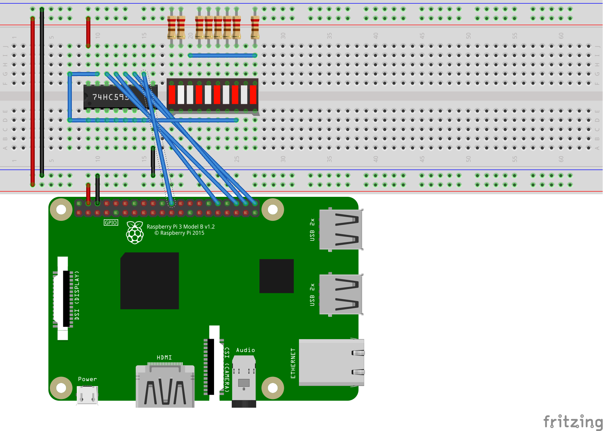

# SN74HC595 -- 8-Bit Shift Register

[SN74HC595](https://www.ti.com/lit/ds/symlink/sn74hc595.pdf) is a 8-bit shift register. Per the datasheet, the SN74HC595 is a "8-Bit Shift Register With 3-State Output Register". The [`Sn74hc595` binding](Sn74hc595.cs) is based on and is compatible with the more general [`ShiftRegister`](../ShiftRegister/README.md) binding. The `Sn74hc595` binding adds the ability clear the storage register with a single pin. Either binding can be used to control the SN74HC595.


The [binding](Sn74hc595.cs) abstracts the interaction with the data register, the register clock and other shift register capabilities. The binding enables interaction via GPIO or SPI.

The [SN74HC595 sample](samples/README.md) demonstrates how to use the shift register. The [generic shift register sample](../ShiftRegister/samples/README.md) is more extensive and is compatible with the SN74HC595.

## Usage

The following example code demonstrates how to use the SN74HC595 with its most basic functions.

```csharp
var sr = new Sn74hc595(Sn74hc595PinMapping.Standard);

// Light up three of first four LEDs
sr.ShiftBit(1);
sr.ShiftBit(1);
sr.ShiftBit(0);
sr.ShiftBit(1);
sr.Latch();

// Clear register
sr.ClearStorage();

// Write to all 8 registers with a byte value
sr.ShiftByte(0b_1010_1010); //same as integer 170
```

The following diagram demonstrates the required wiring.



If you want to use SPI, see the [`ShiftRegister`](../ShiftRegister/README.md) binding, which includes more information on SPI. 

## Fritzing diagrams

* [SN74HC595 -- GPIO](sn74hc595-led-bar-graph.fzz)
* [SN74HC595 -- SPI](sn74hc595-led-bar-graph-spi.fzz)

## Resources

* Datasheet: https://www.ti.com/lit/ds/symlink/sn74hc595.pdf
* Adafruit: https://www.adafruit.com/product/450
* Tutotial: https://www.youtube.com/watch?v=6fVbJbNPrEU